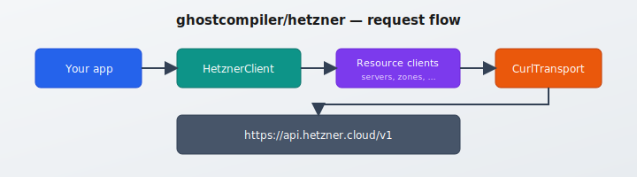

# Hetzner Cloud API — PHP client (cURL)

[](https://www.php.net/)


PHP library for the [Hetzner Cloud API](https://docs.hetzner.cloud/reference/cloud). HTTP is done with **PHP’s `curl` extension only** (no PECL `http`, no Guzzle, no stream wrappers), so you avoid common extension clashes across PHP installs.

Official OpenAPI description: [cloud.spec.json](https://docs.hetzner.cloud/cloud.spec.json).

## Architecture diagram



## Requirements

- PHP **8.1+**
- Extensions: **`curl`**, **`json`**

## Installation

```bash
composer require ghostcompiler/hetzner
```

Or add the path repository if you develop locally:

```json
{
  "repositories": [{ "type": "path", "url": "../hetzner" }],
  "require": { "ghostcompiler/hetzner": "*" }
}
```

## Quick start

```php
<?php

require __DIR__ . '/vendor/autoload.php';

use Ghostcompiler\Hetzner\HetznerClient;
use Ghostcompiler\Hetzner\ApiException;

$token = getenv('HETZNER_TOKEN') ?: '';
$hc = new HetznerClient($token);

try {
    $data = $hc->locations->listLocations();
    // $data is the decoded JSON root, e.g. [ 'locations' => [...], 'meta' => [...] ]
} catch (ApiException $e) {
    echo $e->getMessage(), ' (HTTP ', $e->getHttpStatus(), ")\n";
    if ($e->getApiErrorCode()) {
        echo 'API code: ', $e->getApiErrorCode(), "\n";
    }
}
```

### Optional base URL

For testing or proxies, pass a second argument:

```php
$hc = new HetznerClient($token, 'https://api.hetzner.cloud/v1');
```

## Testing (PHPUnit)

Install dev dependencies, then run the default suite (no real API calls):

```bash
composer install
composer test
# same as: ./vendor/bin/phpunit
```

By default, **integration** tests that call Hetzner are **excluded**. To run them, set a project API token and enable the group:

```bash
export HETZNER_TOKEN='your-token-here'
./vendor/bin/phpunit --group integration
```

## Interactive demo (browser)

The [`demo/`](demo/) folder is a **single-page explorer** (uses a little JavaScript for `fetch` + copy):

1. Enter your **API token** once at the top (optional **Save in browser** → `localStorage`).
2. Expand any **resource client** — every **public method** is listed with an **official summary**, **HTTP verb**, **path**, and a **short description** (from Hetzner’s OpenAPI spec), plus usage hints.
3. Adjust parameters (JSON in textareas for `query` / `body` / `ids`, etc.), click **Run** for a **live** call via [`demo/api.php`](demo/api.php).
4. **Copy response** copies the full JSON (success or error) to the clipboard.

Use the **search box** to filter clients/methods by name.

**Security:** local use only; do not expose `demo/` on a public server.

From the **repository root**:

```bash
composer install
php -S 127.0.0.1:8080 -t demo
```

Open [http://127.0.0.1:8080](http://127.0.0.1:8080) in your browser.

## Method reference (every command, with descriptions)

This README includes an **“All functions (usage)”** section (PHP signatures + HTTP + path + summary). **[docs/METHOD_REFERENCE.md](docs/METHOD_REFERENCE.md)** lists the same methods with **longer descriptions**, aligned with the [Hetzner Cloud OpenAPI spec](https://docs.hetzner.cloud/cloud.spec.json). The [interactive demo](demo/) reads summaries from [`demo/includes/method_summaries.json`](demo/includes/method_summaries.json).

## How requests are built


1. You call a method on a resource client (for example `$hc->servers->listServers()`).
2. The client builds a path and query/body and delegates to `CurlTransport`.
3. cURL sends HTTPS with `Authorization: Bearer <token>` and `Accept: application/json`.
4. On **HTTP 2xx**, the JSON body is decoded to a PHP `array` and returned.
5. On **HTTP 4xx/5xx** or cURL failure, an `ApiException` is thrown.

## Authentication

Create a token in the [Hetzner Cloud Console](https://console.hetzner.cloud/) under your project: **Security → API Tokens**. Pass it as the first constructor argument. Tokens are scoped to one project.

## Pagination, sorting, filters

List endpoints accept an optional `$query` array. Keys are sent as query parameters. **Array values** become repeated keys (for example multiple `sort` or `id` values):

```php
$hc->servers->listServers([
    'page' => 1,
    'per_page' => 50,
    'label_selector' => 'env=production',
    'sort' => ['name:asc', 'id:desc'],
]);
```

See the official docs for each resource’s supported query parameters.

## Rate limiting

Successful responses include headers such as `RateLimit-Limit`, `RateLimit-Remaining`, and `RateLimit-Reset`. This library throws on error status codes before you would read those headers on success responses. For advanced use, you could extend `CurlTransport` to expose full responses; by default resource methods return **only the decoded JSON body** as an array.

## Errors

Failures throw `Ghostcompiler\Hetzner\ApiException`:

| Method | Meaning |
|--------|---------|
| `getMessage()` | Human-readable message (from API when available) |
| `getHttpStatus()` | HTTP status code |
| `getApiError()` | Full `error` object from JSON, if present |
| `getApiErrorCode()` | Short machine code, e.g. `invalid_input` |
| `getResponseHeaders()` | Parsed response headers (lowercase names) |

Error format reference: [Hetzner API — Errors](https://docs.hetzner.cloud/reference/cloud#error-codes).

## Important: global Actions list

`GET /actions` **no longer lists all actions**. You must pass one or more action IDs as repeated `id` query parameters. Use `ActionsClient::getActions()`:

```php
$hc->actions->getActions([1001, 1002], ['per_page' => 25]);
```

## Resource clients and methods

Each method maps to one HTTP call. Bodies are PHP `array` values shaped like the JSON in the [official API docs](https://docs.hetzner.cloud/reference/cloud). Many POST actions send an empty JSON object `{}` internally when no fields are required.

Extended descriptions for each method: **[docs/METHOD_REFERENCE.md](docs/METHOD_REFERENCE.md)** and the [interactive demo](demo/). The **complete PHP usage table** (signatures + HTTP + path + summary) is in the next section.

### What each `HetznerClient` property is for

| Property | PHP class | Purpose |
| --- | --- | --- |
| `actions` | `ActionsClient` | Fetch asynchronous **Action** objects (tasks) by id; global listing was removed by Hetzner—see note above. |
| `certificates` | `CertificatesClient` | TLS certificates (**uploaded** PEM or **managed** Let's Encrypt via Hetzner DNS). |
| `datacenters` | `DatacentersClient` | List **datacenters** (where servers can run). |
| `firewalls` | `FirewallsClient` | **Firewalls**: rules, attach/detach to servers, etc. |
| `floatingIps` | `FloatingIpsClient` | **Floating IPv4/IPv6** addresses and assign/unassign to servers. |
| `images` | `ImagesClient` | **Images** (OS, snapshots, backups): list, update labels, delete, protection. |
| `isos` | `IsosClient` | **ISO** images for manual OS installs. |
| `loadBalancers` | `LoadBalancersClient` | **Load balancers**, targets, services, networks, metrics. |
| `loadBalancerTypes` | `LoadBalancerTypesClient` | Available **load balancer product types** and pricing hints. |
| `locations` | `LocationsClient` | **Locations** (cities/regions) and metadata. |
| `networks` | `NetworksClient` | **Private networks**, subnets, routes, vswitch coupling. |
| `placementGroups` | `PlacementGroupsClient` | **Placement groups** (e.g. spread VMs across hardware). |
| `pricing` | `PricingClient` | **List prices** for resource types in the project currency. |
| `primaryIps` | `PrimaryIpsClient` | **Primary IPs** bound to a location; assign to servers. |
| `servers` | `ServersClient` | **Servers** (VMs): CRUD, power, rescue, backups, networks, metrics, etc. |
| `serverTypes` | `ServerTypesClient` | **Server plans** (`cx22`, …) and pricing hints. |
| `sshKeys` | `SshKeysClient` | **SSH public keys** injected at server create. |
| `volumes` | `VolumesClient` | **Volumes** (block storage): attach, detach, resize. |
| `zones` | `ZonesClient` | **DNS zones** and **RRsets** (records) on Hetzner nameservers. |

### Code examples

Create a server, manage DNS, TLS, and load balancer (field names must match the official API):

```php
$hc->servers->createServer([
    'name' => 'app-1',
    'server_type' => 'cx22',
    'image' => 'ubuntu-22.04',
    'location' => 'nbg1',
    'ssh_keys' => [123456],
]);
$hc->servers->poweronServer(42);

$hc->certificates->createCertificate([
    'name' => 'api-cert',
    'type' => 'managed',
    'domain_names' => ['api.example.com'],
]);

$hc->loadBalancers->createLoadBalancer([
    'name' => 'lb1',
    'load_balancer_type' => 'lb11',
    'location' => 'nbg1',
    'network' => 12345,
    'services' => [],
    'targets' => [],
]);

$hc->zones->listZones();
$hc->zones->getZoneRrset('example.com', '@', 'A');
$hc->zones->setZoneRrsetRecords('example.com', 'www', 'A', [
    'records' => [['value' => '1.2.3.4']],
]);
```

<!-- AUTO_FUNCTION_REFERENCE_START -->

## All functions (usage)

Each call returns a decoded JSON **array** (the API response root). Throws `Ghostcompiler\Hetzner\ApiException` on HTTP errors.

**Pattern:** `$hc->{client}->{methodName}(...arguments...)` where `{client}` is a property of [`HetznerClient`](src/HetznerClient.php).

### `actions` — `ActionsClient`

| PHP usage | HTTP | Path | What it does |
| --- | --- | --- | --- |
| <code>$hc->actions->getAction(string|int $id)</code> | GET | <code>/actions/{id}</code> | Get an Action |
| <code>$hc->actions->getActions(array $ids, array $extra = [])</code> | GET | <code>/actions</code> | Get multiple Actions |

### `certificates` — `CertificatesClient`

| PHP usage | HTTP | Path | What it does |
| --- | --- | --- | --- |
| <code>$hc->certificates->createCertificate(array $body)</code> | POST | <code>/certificates</code> | Create a Certificate |
| <code>$hc->certificates->deleteCertificate(string|int $id)</code> | DELETE | <code>/certificates/{id}</code> | Delete a Certificate |
| <code>$hc->certificates->getCertificate(string|int $id)</code> | GET | <code>/certificates/{id}</code> | Get a Certificate |
| <code>$hc->certificates->getCertificateAction(string|int $id, string|int $actionId)</code> | GET | <code>/certificates/{id}/actions/{action_id}</code> | Get an Action for a Certificate |
| <code>$hc->certificates->getCertificatesAction(string|int $id)</code> | GET | <code>/certificates/actions/{id}</code> | Get an Action |
| <code>$hc->certificates->listCertificateActions(string|int $id, array $query = [])</code> | GET | <code>/certificates/{id}/actions</code> | List Actions for a Certificate |
| <code>$hc->certificates->listCertificates(array $query = [])</code> | GET | <code>/certificates</code> | List Certificates |
| <code>$hc->certificates->listCertificatesActions(array $query = [])</code> | GET | <code>/certificates/actions</code> | List Actions |
| <code>$hc->certificates->retryCertificate(string|int $id)</code> | POST | <code>/certificates/{id}/actions/retry</code> | Retry Issuance or Renewal |
| <code>$hc->certificates->updateCertificate(string|int $id, array $body)</code> | PUT | <code>/certificates/{id}</code> | Update a Certificate |

### `datacenters` — `DatacentersClient`

| PHP usage | HTTP | Path | What it does |
| --- | --- | --- | --- |
| <code>$hc->datacenters->getDatacenter(string|int $id)</code> | GET | <code>/datacenters/{id}</code> | Get a Data Center |
| <code>$hc->datacenters->listDatacenters(array $query = [])</code> | GET | <code>/datacenters</code> | List Data Centers |

### `firewalls` — `FirewallsClient`

| PHP usage | HTTP | Path | What it does |
| --- | --- | --- | --- |
| <code>$hc->firewalls->applyFirewallToResources(string|int $id, array $body)</code> | POST | <code>/firewalls/{id}/actions/apply_to_resources</code> | Apply to Resources |
| <code>$hc->firewalls->createFirewall(array $body)</code> | POST | <code>/firewalls</code> | Create a Firewall |
| <code>$hc->firewalls->deleteFirewall(string|int $id)</code> | DELETE | <code>/firewalls/{id}</code> | Delete a Firewall |
| <code>$hc->firewalls->getFirewall(string|int $id)</code> | GET | <code>/firewalls/{id}</code> | Get a Firewall |
| <code>$hc->firewalls->getFirewallAction(string|int $id, string|int $actionId)</code> | GET | <code>/firewalls/{id}/actions/{action_id}</code> | Get an Action for a Firewall |
| <code>$hc->firewalls->getFirewallsAction(string|int $id)</code> | GET | <code>/firewalls/actions/{id}</code> | Get an Action |
| <code>$hc->firewalls->listFirewallActions(string|int $id, array $query = [])</code> | GET | <code>/firewalls/{id}/actions</code> | List Actions for a Firewall |
| <code>$hc->firewalls->listFirewalls(array $query = [])</code> | GET | <code>/firewalls</code> | List Firewalls |
| <code>$hc->firewalls->listFirewallsActions(array $query = [])</code> | GET | <code>/firewalls/actions</code> | List Actions |
| <code>$hc->firewalls->removeFirewallFromResources(string|int $id, array $body)</code> | POST | <code>/firewalls/{id}/actions/remove_from_resources</code> | Remove from Resources |
| <code>$hc->firewalls->setFirewallRules(string|int $id, array $body)</code> | POST | <code>/firewalls/{id}/actions/set_rules</code> | Set Rules |
| <code>$hc->firewalls->updateFirewall(string|int $id, array $body)</code> | PUT | <code>/firewalls/{id}</code> | Update a Firewall |

### `floatingIps` — `FloatingIpsClient`

| PHP usage | HTTP | Path | What it does |
| --- | --- | --- | --- |
| <code>$hc->floatingIps->assignFloatingIp(string|int $id, array $body)</code> | POST | <code>/floating_ips/{id}/actions/assign</code> | Assign a Floating IP to a Server |
| <code>$hc->floatingIps->changeFloatingIpDnsPtr(string|int $id, array $body)</code> | POST | <code>/floating_ips/{id}/actions/change_dns_ptr</code> | Change reverse DNS records for a Floating IP |
| <code>$hc->floatingIps->changeFloatingIpProtection(string|int $id, array $body)</code> | POST | <code>/floating_ips/{id}/actions/change_protection</code> | Change Floating IP Protection |
| <code>$hc->floatingIps->createFloatingIp(array $body)</code> | POST | <code>/floating_ips</code> | Create a Floating IP |
| <code>$hc->floatingIps->deleteFloatingIp(string|int $id)</code> | DELETE | <code>/floating_ips/{id}</code> | Delete a Floating IP |
| <code>$hc->floatingIps->getFloatingIp(string|int $id)</code> | GET | <code>/floating_ips/{id}</code> | Get a Floating IP |
| <code>$hc->floatingIps->getFloatingIpAction(string|int $id, string|int $actionId)</code> | GET | <code>/floating_ips/{id}/actions/{action_id}</code> | Get an Action for a Floating IP |
| <code>$hc->floatingIps->getFloatingIpsAction(string|int $id)</code> | GET | <code>/floating_ips/actions/{id}</code> | Get an Action |
| <code>$hc->floatingIps->listFloatingIpActions(string|int $id, array $query = [])</code> | GET | <code>/floating_ips/{id}/actions</code> | List Actions for a Floating IP |
| <code>$hc->floatingIps->listFloatingIps(array $query = [])</code> | GET | <code>/floating_ips</code> | List Floating IPs |
| <code>$hc->floatingIps->listFloatingIpsActions(array $query = [])</code> | GET | <code>/floating_ips/actions</code> | List Actions |
| <code>$hc->floatingIps->unassignFloatingIp(string|int $id)</code> | POST | <code>/floating_ips/{id}/actions/unassign</code> | Unassign a Floating IP |
| <code>$hc->floatingIps->updateFloatingIp(string|int $id, array $body)</code> | PUT | <code>/floating_ips/{id}</code> | Update a Floating IP |

### `images` — `ImagesClient`

| PHP usage | HTTP | Path | What it does |
| --- | --- | --- | --- |
| <code>$hc->images->changeImageProtection(string|int $id, array $body)</code> | POST | <code>/images/{id}/actions/change_protection</code> | Change Image Protection |
| <code>$hc->images->deleteImage(string|int $id)</code> | DELETE | <code>/images/{id}</code> | Delete an Image |
| <code>$hc->images->getImage(string|int $id)</code> | GET | <code>/images/{id}</code> | Get an Image |
| <code>$hc->images->getImageAction(string|int $id, string|int $actionId)</code> | GET | <code>/images/{id}/actions/{action_id}</code> | Get an Action for an Image |
| <code>$hc->images->getImagesAction(string|int $id)</code> | GET | <code>/images/actions/{id}</code> | Get an Action |
| <code>$hc->images->listImageActions(string|int $id, array $query = [])</code> | GET | <code>/images/{id}/actions</code> | List Actions for an Image |
| <code>$hc->images->listImages(array $query = [])</code> | GET | <code>/images</code> | List Images |
| <code>$hc->images->listImagesActions(array $query = [])</code> | GET | <code>/images/actions</code> | List Actions |
| <code>$hc->images->updateImage(string|int $id, array $body)</code> | PUT | <code>/images/{id}</code> | Update an Image |

### `isos` — `IsosClient`

| PHP usage | HTTP | Path | What it does |
| --- | --- | --- | --- |
| <code>$hc->isos->getIso(string|int $id)</code> | GET | <code>/isos/{id}</code> | Get an ISO |
| <code>$hc->isos->listIsos(array $query = [])</code> | GET | <code>/isos</code> | List ISOs |

### `loadBalancerTypes` — `LoadBalancerTypesClient`

| PHP usage | HTTP | Path | What it does |
| --- | --- | --- | --- |
| <code>$hc->loadBalancerTypes->getLoadBalancerType(string|int $id)</code> | GET | <code>/load_balancer_types/{id}</code> | Get a Load Balancer Type |
| <code>$hc->loadBalancerTypes->listLoadBalancerTypes(array $query = [])</code> | GET | <code>/load_balancer_types</code> | List Load Balancer Types |

### `loadBalancers` — `LoadBalancersClient`

| PHP usage | HTTP | Path | What it does |
| --- | --- | --- | --- |
| <code>$hc->loadBalancers->addLoadBalancerService(string|int $id, array $body)</code> | POST | <code>/load_balancers/{id}/actions/add_service</code> | Add Service |
| <code>$hc->loadBalancers->addLoadBalancerTarget(string|int $id, array $body)</code> | POST | <code>/load_balancers/{id}/actions/add_target</code> | Add Target |
| <code>$hc->loadBalancers->attachLoadBalancerToNetwork(string|int $id, array $body)</code> | POST | <code>/load_balancers/{id}/actions/attach_to_network</code> | Attach a Load Balancer to a Network |
| <code>$hc->loadBalancers->changeLoadBalancerAlgorithm(string|int $id, array $body)</code> | POST | <code>/load_balancers/{id}/actions/change_algorithm</code> | Change Algorithm |
| <code>$hc->loadBalancers->changeLoadBalancerDnsPtr(string|int $id, array $body)</code> | POST | <code>/load_balancers/{id}/actions/change_dns_ptr</code> | Change reverse DNS entry for this Load Balancer |
| <code>$hc->loadBalancers->changeLoadBalancerProtection(string|int $id, array $body)</code> | POST | <code>/load_balancers/{id}/actions/change_protection</code> | Change Load Balancer Protection |
| <code>$hc->loadBalancers->changeLoadBalancerType(string|int $id, array $body)</code> | POST | <code>/load_balancers/{id}/actions/change_type</code> | Change the Type of a Load Balancer |
| <code>$hc->loadBalancers->createLoadBalancer(array $body)</code> | POST | <code>/load_balancers</code> | Create a Load Balancer |
| <code>$hc->loadBalancers->deleteLoadBalancer(string|int $id)</code> | DELETE | <code>/load_balancers/{id}</code> | Delete a Load Balancer |
| <code>$hc->loadBalancers->deleteLoadBalancerService(string|int $id, array $body)</code> | POST | <code>/load_balancers/{id}/actions/delete_service</code> | Delete Service |
| <code>$hc->loadBalancers->detachLoadBalancerFromNetwork(string|int $id, array $body)</code> | POST | <code>/load_balancers/{id}/actions/detach_from_network</code> | Detach a Load Balancer from a Network |
| <code>$hc->loadBalancers->disableLoadBalancerPublicInterface(string|int $id)</code> | POST | <code>/load_balancers/{id}/actions/disable_public_interface</code> | Disable the public interface of a Load Balancer |
| <code>$hc->loadBalancers->enableLoadBalancerPublicInterface(string|int $id)</code> | POST | <code>/load_balancers/{id}/actions/enable_public_interface</code> | Enable the public interface of a Load Balancer |
| <code>$hc->loadBalancers->getLoadBalancer(string|int $id)</code> | GET | <code>/load_balancers/{id}</code> | Get a Load Balancer |
| <code>$hc->loadBalancers->getLoadBalancerAction(string|int $id, string|int $actionId)</code> | GET | <code>/load_balancers/{id}/actions/{action_id}</code> | Get an Action for a Load Balancer |
| <code>$hc->loadBalancers->getLoadBalancerMetrics(string|int $id, array $query)</code> | GET | <code>/load_balancers/{id}/metrics</code> | Get Metrics for a LoadBalancer |
| <code>$hc->loadBalancers->getLoadBalancersAction(string|int $id)</code> | GET | <code>/load_balancers/actions/{id}</code> | Get an Action |
| <code>$hc->loadBalancers->listLoadBalancerActions(string|int $id, array $query = [])</code> | GET | <code>/load_balancers/{id}/actions</code> | List Actions for a Load Balancer |
| <code>$hc->loadBalancers->listLoadBalancers(array $query = [])</code> | GET | <code>/load_balancers</code> | List Load Balancers |
| <code>$hc->loadBalancers->listLoadBalancersActions(array $query = [])</code> | GET | <code>/load_balancers/actions</code> | List Actions |
| <code>$hc->loadBalancers->removeLoadBalancerTarget(string|int $id, array $body)</code> | POST | <code>/load_balancers/{id}/actions/remove_target</code> | Remove Target |
| <code>$hc->loadBalancers->updateLoadBalancer(string|int $id, array $body)</code> | PUT | <code>/load_balancers/{id}</code> | Update a Load Balancer |
| <code>$hc->loadBalancers->updateLoadBalancerService(string|int $id, array $body)</code> | POST | <code>/load_balancers/{id}/actions/update_service</code> | Update Service |

### `locations` — `LocationsClient`

| PHP usage | HTTP | Path | What it does |
| --- | --- | --- | --- |
| <code>$hc->locations->getLocation(string|int $id)</code> | GET | <code>/locations/{id}</code> | Get a Location |
| <code>$hc->locations->listLocations(array $query = [])</code> | GET | <code>/locations</code> | List Locations |

### `networks` — `NetworksClient`

| PHP usage | HTTP | Path | What it does |
| --- | --- | --- | --- |
| <code>$hc->networks->addNetworkRoute(string|int $id, array $body)</code> | POST | <code>/networks/{id}/actions/add_route</code> | Add a route to a Network |
| <code>$hc->networks->addNetworkSubnet(string|int $id, array $body)</code> | POST | <code>/networks/{id}/actions/add_subnet</code> | Add a subnet to a Network |
| <code>$hc->networks->changeNetworkIpRange(string|int $id, array $body)</code> | POST | <code>/networks/{id}/actions/change_ip_range</code> | Change IP range of a Network |
| <code>$hc->networks->changeNetworkProtection(string|int $id, array $body)</code> | POST | <code>/networks/{id}/actions/change_protection</code> | Change Network Protection |
| <code>$hc->networks->createNetwork(array $body)</code> | POST | <code>/networks</code> | Create a Network |
| <code>$hc->networks->deleteNetwork(string|int $id)</code> | DELETE | <code>/networks/{id}</code> | Delete a Network |
| <code>$hc->networks->deleteNetworkRoute(string|int $id, array $body)</code> | POST | <code>/networks/{id}/actions/delete_route</code> | Delete a route from a Network |
| <code>$hc->networks->deleteNetworkSubnet(string|int $id, array $body)</code> | POST | <code>/networks/{id}/actions/delete_subnet</code> | Delete a subnet from a Network |
| <code>$hc->networks->getNetwork(string|int $id)</code> | GET | <code>/networks/{id}</code> | Get a Network |
| <code>$hc->networks->getNetworkAction(string|int $id, string|int $actionId)</code> | GET | <code>/networks/{id}/actions/{action_id}</code> | Get an Action for a Network |
| <code>$hc->networks->getNetworksAction(string|int $id)</code> | GET | <code>/networks/actions/{id}</code> | Get an Action |
| <code>$hc->networks->listNetworkActions(string|int $id, array $query = [])</code> | GET | <code>/networks/{id}/actions</code> | List Actions for a Network |
| <code>$hc->networks->listNetworks(array $query = [])</code> | GET | <code>/networks</code> | List Networks |
| <code>$hc->networks->listNetworksActions(array $query = [])</code> | GET | <code>/networks/actions</code> | List Actions |
| <code>$hc->networks->updateNetwork(string|int $id, array $body)</code> | PUT | <code>/networks/{id}</code> | Update a Network |

### `placementGroups` — `PlacementGroupsClient`

| PHP usage | HTTP | Path | What it does |
| --- | --- | --- | --- |
| <code>$hc->placementGroups->createPlacementGroup(array $body)</code> | POST | <code>/placement_groups</code> | Create a PlacementGroup |
| <code>$hc->placementGroups->deletePlacementGroup(string|int $id)</code> | DELETE | <code>/placement_groups/{id}</code> | Delete a PlacementGroup |
| <code>$hc->placementGroups->getPlacementGroup(string|int $id)</code> | GET | <code>/placement_groups/{id}</code> | Get a PlacementGroup |
| <code>$hc->placementGroups->listPlacementGroups(array $query = [])</code> | GET | <code>/placement_groups</code> | List Placement Groups |
| <code>$hc->placementGroups->updatePlacementGroup(string|int $id, array $body)</code> | PUT | <code>/placement_groups/{id}</code> | Update a PlacementGroup |

### `pricing` — `PricingClient`

| PHP usage | HTTP | Path | What it does |
| --- | --- | --- | --- |
| <code>$hc->pricing->getPricing()</code> | GET | <code>/pricing</code> | Get all prices |

### `primaryIps` — `PrimaryIpsClient`

| PHP usage | HTTP | Path | What it does |
| --- | --- | --- | --- |
| <code>$hc->primaryIps->assignPrimaryIp(string|int $id, array $body)</code> | POST | <code>/primary_ips/{id}/actions/assign</code> | Assign a Primary IP to a resource |
| <code>$hc->primaryIps->changePrimaryIpDnsPtr(string|int $id, array $body)</code> | POST | <code>/primary_ips/{id}/actions/change_dns_ptr</code> | Change reverse DNS records for a Primary IP |
| <code>$hc->primaryIps->changePrimaryIpProtection(string|int $id, array $body)</code> | POST | <code>/primary_ips/{id}/actions/change_protection</code> | Change Primary IP Protection |
| <code>$hc->primaryIps->createPrimaryIp(array $body)</code> | POST | <code>/primary_ips</code> | Create a Primary IP |
| <code>$hc->primaryIps->deletePrimaryIp(string|int $id)</code> | DELETE | <code>/primary_ips/{id}</code> | Delete a Primary IP |
| <code>$hc->primaryIps->getPrimaryIp(string|int $id)</code> | GET | <code>/primary_ips/{id}</code> | Get a Primary IP |
| <code>$hc->primaryIps->getPrimaryIpAction(string|int $id, string|int $actionId)</code> | GET | <code>/primary_ips/{id}/actions/{action_id}</code> | Get an Action for a Primary IP |
| <code>$hc->primaryIps->getPrimaryIpsAction(string|int $id)</code> | GET | <code>/primary_ips/actions/{id}</code> | Get an Action |
| <code>$hc->primaryIps->listPrimaryIpActions(string|int $id, array $query = [])</code> | GET | <code>/primary_ips/{id}/actions</code> | List Actions for a Primary IP |
| <code>$hc->primaryIps->listPrimaryIps(array $query = [])</code> | GET | <code>/primary_ips</code> | List Primary IPs |
| <code>$hc->primaryIps->listPrimaryIpsActions(array $query = [])</code> | GET | <code>/primary_ips/actions</code> | List Actions |
| <code>$hc->primaryIps->unassignPrimaryIp(string|int $id)</code> | POST | <code>/primary_ips/{id}/actions/unassign</code> | Unassign a Primary IP from a resource |
| <code>$hc->primaryIps->updatePrimaryIp(string|int $id, array $body)</code> | PUT | <code>/primary_ips/{id}</code> | Update a Primary IP |

### `serverTypes` — `ServerTypesClient`

| PHP usage | HTTP | Path | What it does |
| --- | --- | --- | --- |
| <code>$hc->serverTypes->getServerType(string|int $id)</code> | GET | <code>/server_types/{id}</code> | Get a Server Type |
| <code>$hc->serverTypes->listServerTypes(array $query = [])</code> | GET | <code>/server_types</code> | List Server Types |

### `servers` — `ServersClient`

| PHP usage | HTTP | Path | What it does |
| --- | --- | --- | --- |
| <code>$hc->servers->addServerToPlacementGroup(string|int $id, array $body)</code> | POST | <code>/servers/{id}/actions/add_to_placement_group</code> | Add a Server to a Placement Group |
| <code>$hc->servers->attachServerIso(string|int $id, array $body)</code> | POST | <code>/servers/{id}/actions/attach_iso</code> | Attach an ISO to a Server |
| <code>$hc->servers->attachServerToNetwork(string|int $id, array $body)</code> | POST | <code>/servers/{id}/actions/attach_to_network</code> | Attach a Server to a Network |
| <code>$hc->servers->changeServerAliasIps(string|int $id, array $body)</code> | POST | <code>/servers/{id}/actions/change_alias_ips</code> | Change alias IPs of a Network |
| <code>$hc->servers->changeServerDnsPtr(string|int $id, array $body)</code> | POST | <code>/servers/{id}/actions/change_dns_ptr</code> | Change reverse DNS entry for this Server |
| <code>$hc->servers->changeServerProtection(string|int $id, array $body)</code> | POST | <code>/servers/{id}/actions/change_protection</code> | Change Server Protection |
| <code>$hc->servers->changeServerType(string|int $id, array $body)</code> | POST | <code>/servers/{id}/actions/change_type</code> | Change the Type of a Server |
| <code>$hc->servers->createServer(array $body)</code> | POST | <code>/servers</code> | Create a Server |
| <code>$hc->servers->createServerImage(string|int $id, array $body)</code> | POST | <code>/servers/{id}/actions/create_image</code> | Create Image from a Server |
| <code>$hc->servers->deleteServer(string|int $id)</code> | DELETE | <code>/servers/{id}</code> | Delete a Server |
| <code>$hc->servers->detachServerFromNetwork(string|int $id, array $body)</code> | POST | <code>/servers/{id}/actions/detach_from_network</code> | Detach a Server from a Network |
| <code>$hc->servers->detachServerIso(string|int $id)</code> | POST | <code>/servers/{id}/actions/detach_iso</code> | Detach an ISO from a Server |
| <code>$hc->servers->disableServerBackup(string|int $id)</code> | POST | <code>/servers/{id}/actions/disable_backup</code> | Disable Backups for a Server |
| <code>$hc->servers->disableServerRescue(string|int $id)</code> | POST | <code>/servers/{id}/actions/disable_rescue</code> | Disable Rescue Mode for a Server |
| <code>$hc->servers->enableServerBackup(string|int $id)</code> | POST | <code>/servers/{id}/actions/enable_backup</code> | Enable and Configure Backups for a Server |
| <code>$hc->servers->enableServerRescue(string|int $id, array $body = [])</code> | POST | <code>/servers/{id}/actions/enable_rescue</code> | Enable Rescue Mode for a Server |
| <code>$hc->servers->getServer(string|int $id)</code> | GET | <code>/servers/{id}</code> | Get a Server |
| <code>$hc->servers->getServerAction(string|int $id, string|int $actionId)</code> | GET | <code>/servers/{id}/actions/{action_id}</code> | Get an Action for a Server |
| <code>$hc->servers->getServerMetrics(string|int $id, array $query)</code> | GET | <code>/servers/{id}/metrics</code> | Get Metrics for a Server |
| <code>$hc->servers->getServersAction(string|int $id)</code> | GET | <code>/servers/actions/{id}</code> | Get an Action |
| <code>$hc->servers->listServerActions(string|int $id, array $query = [])</code> | GET | <code>/servers/{id}/actions</code> | List Actions for a Server |
| <code>$hc->servers->listServers(array $query = [])</code> | GET | <code>/servers</code> | List Servers |
| <code>$hc->servers->listServersActions(array $query = [])</code> | GET | <code>/servers/actions</code> | List Actions |
| <code>$hc->servers->poweroffServer(string|int $id)</code> | POST | <code>/servers/{id}/actions/poweroff</code> | Power off a Server |
| <code>$hc->servers->poweronServer(string|int $id)</code> | POST | <code>/servers/{id}/actions/poweron</code> | Power on a Server |
| <code>$hc->servers->rebootServer(string|int $id)</code> | POST | <code>/servers/{id}/actions/reboot</code> | Soft-reboot a Server |
| <code>$hc->servers->rebuildServer(string|int $id, array $body)</code> | POST | <code>/servers/{id}/actions/rebuild</code> | Rebuild a Server from an Image |
| <code>$hc->servers->removeServerFromPlacementGroup(string|int $id)</code> | POST | <code>/servers/{id}/actions/remove_from_placement_group</code> | Remove from Placement Group |
| <code>$hc->servers->requestServerConsole(string|int $id)</code> | POST | <code>/servers/{id}/actions/request_console</code> | Request Console for a Server |
| <code>$hc->servers->resetServer(string|int $id)</code> | POST | <code>/servers/{id}/actions/reset</code> | Reset a Server |
| <code>$hc->servers->resetServerPassword(string|int $id)</code> | POST | <code>/servers/{id}/actions/reset_password</code> | Reset root Password of a Server |
| <code>$hc->servers->shutdownServer(string|int $id)</code> | POST | <code>/servers/{id}/actions/shutdown</code> | Shutdown a Server |
| <code>$hc->servers->updateServer(string|int $id, array $body)</code> | PUT | <code>/servers/{id}</code> | Update a Server |

### `sshKeys` — `SshKeysClient`

| PHP usage | HTTP | Path | What it does |
| --- | --- | --- | --- |
| <code>$hc->sshKeys->createSshKey(array $body)</code> | POST | <code>/ssh_keys</code> | Create an SSH key |
| <code>$hc->sshKeys->deleteSshKey(string|int $id)</code> | DELETE | <code>/ssh_keys/{id}</code> | Delete an SSH key |
| <code>$hc->sshKeys->getSshKey(string|int $id)</code> | GET | <code>/ssh_keys/{id}</code> | Get a SSH key |
| <code>$hc->sshKeys->listSshKeys(array $query = [])</code> | GET | <code>/ssh_keys</code> | List SSH keys |
| <code>$hc->sshKeys->updateSshKey(string|int $id, array $body)</code> | PUT | <code>/ssh_keys/{id}</code> | Update an SSH key |

### `volumes` — `VolumesClient`

| PHP usage | HTTP | Path | What it does |
| --- | --- | --- | --- |
| <code>$hc->volumes->attachVolume(string|int $id, array $body)</code> | POST | <code>/volumes/{id}/actions/attach</code> | Attach Volume to a Server |
| <code>$hc->volumes->changeVolumeProtection(string|int $id, array $body)</code> | POST | <code>/volumes/{id}/actions/change_protection</code> | Change Volume Protection |
| <code>$hc->volumes->createVolume(array $body)</code> | POST | <code>/volumes</code> | Create a Volume |
| <code>$hc->volumes->deleteVolume(string|int $id)</code> | DELETE | <code>/volumes/{id}</code> | Delete a Volume |
| <code>$hc->volumes->detachVolume(string|int $id)</code> | POST | <code>/volumes/{id}/actions/detach</code> | Detach Volume |
| <code>$hc->volumes->getVolume(string|int $id)</code> | GET | <code>/volumes/{id}</code> | Get a Volume |
| <code>$hc->volumes->getVolumeAction(string|int $id, string|int $actionId)</code> | GET | <code>/volumes/{id}/actions/{action_id}</code> | Get an Action for a Volume |
| <code>$hc->volumes->getVolumesAction(string|int $id)</code> | GET | <code>/volumes/actions/{id}</code> | Get an Action |
| <code>$hc->volumes->listVolumeActions(string|int $id, array $query = [])</code> | GET | <code>/volumes/{id}/actions</code> | List Actions for a Volume |
| <code>$hc->volumes->listVolumes(array $query = [])</code> | GET | <code>/volumes</code> | List Volumes |
| <code>$hc->volumes->listVolumesActions(array $query = [])</code> | GET | <code>/volumes/actions</code> | List Actions |
| <code>$hc->volumes->resizeVolume(string|int $id, array $body)</code> | POST | <code>/volumes/{id}/actions/resize</code> | Resize Volume |
| <code>$hc->volumes->updateVolume(string|int $id, array $body)</code> | PUT | <code>/volumes/{id}</code> | Update a Volume |

### `zones` — `ZonesClient`

| PHP usage | HTTP | Path | What it does |
| --- | --- | --- | --- |
| <code>$hc->zones->addZoneRrsetRecords(string|int $idOrName, string $rrName, string $rrType, array $body)</code> | POST | <code>/zones/{id_or_name}/rrsets/{rr_name}/{rr_type}/actions/add_records</code> | Add Records to an RRSet |
| <code>$hc->zones->changeZonePrimaryNameservers(string|int $idOrName, array $body)</code> | POST | <code>/zones/{id_or_name}/actions/change_primary_nameservers</code> | Change a Zone's Primary Nameservers |
| <code>$hc->zones->changeZoneProtection(string|int $idOrName, array $body)</code> | POST | <code>/zones/{id_or_name}/actions/change_protection</code> | Change a Zone's Protection |
| <code>$hc->zones->changeZoneRrsetProtection(string|int $idOrName, string $rrName, string $rrType, array $body)</code> | POST | <code>/zones/{id_or_name}/rrsets/{rr_name}/{rr_type}/actions/change_protection</code> | Change an RRSet's Protection |
| <code>$hc->zones->changeZoneRrsetTtl(string|int $idOrName, string $rrName, string $rrType, array $body)</code> | POST | <code>/zones/{id_or_name}/rrsets/{rr_name}/{rr_type}/actions/change_ttl</code> | Change an RRSet's TTL |
| <code>$hc->zones->changeZoneTtl(string|int $idOrName, array $body)</code> | POST | <code>/zones/{id_or_name}/actions/change_ttl</code> | Change a Zone's Default TTL |
| <code>$hc->zones->createZone(array $body)</code> | POST | <code>/zones</code> | Create a Zone |
| <code>$hc->zones->createZoneRrset(string|int $idOrName, array $body)</code> | POST | <code>/zones/{id_or_name}/rrsets</code> | Create an RRSet |
| <code>$hc->zones->deleteZone(string|int $idOrName)</code> | DELETE | <code>/zones/{id_or_name}</code> | Delete a Zone |
| <code>$hc->zones->deleteZoneRrset(string|int $idOrName, string $rrName, string $rrType)</code> | DELETE | <code>/zones/{id_or_name}/rrsets/{rr_name}/{rr_type}</code> | Delete an RRSet |
| <code>$hc->zones->getZone(string|int $idOrName)</code> | GET | <code>/zones/{id_or_name}</code> | Get a Zone |
| <code>$hc->zones->getZoneAction(string|int $idOrName, string|int $actionId)</code> | GET | <code>/zones/{id_or_name}/actions/{action_id}</code> | Get an Action for a Zone |
| <code>$hc->zones->getZoneRrset(string|int $idOrName, string $rrName, string $rrType)</code> | GET | <code>/zones/{id_or_name}/rrsets/{rr_name}/{rr_type}</code> | Get an RRSet |
| <code>$hc->zones->getZoneZonefile(string|int $idOrName, array $query = [])</code> | GET | <code>/zones/{id_or_name}/zonefile</code> | Export a Zone file |
| <code>$hc->zones->getZonesAction(string|int $id)</code> | GET | <code>/zones/actions/{id}</code> | Get an Action |
| <code>$hc->zones->importZoneZonefile(string|int $idOrName, array $body)</code> | POST | <code>/zones/{id_or_name}/actions/import_zonefile</code> | Import a Zone file |
| <code>$hc->zones->listZoneActions(string|int $idOrName, array $query = [])</code> | GET | <code>/zones/{id_or_name}/actions</code> | List Actions for a Zone |
| <code>$hc->zones->listZoneRrsets(string|int $idOrName, array $query = [])</code> | GET | <code>/zones/{id_or_name}/rrsets</code> | List RRSets |
| <code>$hc->zones->listZones(array $query = [])</code> | GET | <code>/zones</code> | List Zones |
| <code>$hc->zones->listZonesActions(array $query = [])</code> | GET | <code>/zones/actions</code> | List Actions |
| <code>$hc->zones->removeZoneRrsetRecords(string|int $idOrName, string $rrName, string $rrType, array $body)</code> | POST | <code>/zones/{id_or_name}/rrsets/{rr_name}/{rr_type}/actions/remove_records</code> | Remove Records from an RRSet |
| <code>$hc->zones->setZoneRrsetRecords(string|int $idOrName, string $rrName, string $rrType, array $body)</code> | POST | <code>/zones/{id_or_name}/rrsets/{rr_name}/{rr_type}/actions/set_records</code> | Set Records of an RRSet |
| <code>$hc->zones->updateZone(string|int $idOrName, array $body)</code> | PUT | <code>/zones/{id_or_name}</code> | Update a Zone |
| <code>$hc->zones->updateZoneRrset(string|int $idOrName, string $rrName, string $rrType, array $body)</code> | PUT | <code>/zones/{id_or_name}/rrsets/{rr_name}/{rr_type}</code> | Update an RRSet |
| <code>$hc->zones->updateZoneRrsetRecords(string|int $idOrName, string $rrName, string $rrType, array $body)</code> | POST | <code>/zones/{id_or_name}/rrsets/{rr_name}/{rr_type}/actions/update_records</code> | Update Records of an RRSet |


<!-- AUTO_FUNCTION_REFERENCE_END -->

## License

SPDX: `MIT` (see [composer.json](composer.json)).
